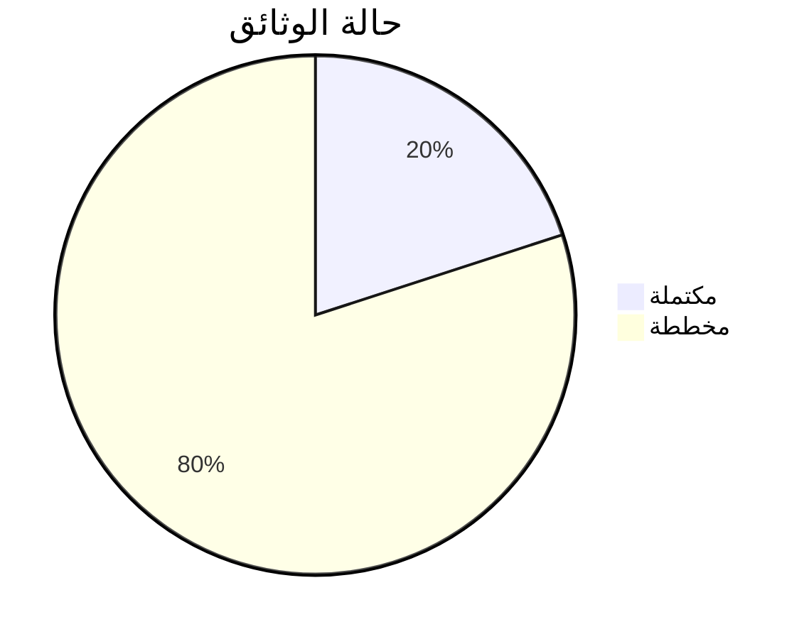

<div align="center">

# 📚 فهرس الوثائق التقنية
## مشروع رزقي - Rezge للزواج الإسلامي

[](https://github.com/your-username/rezge-islamic-marriage)
[](https://github.com/your-username/rezge-islamic-marriage)

**دليل شامل لجميع الوثائق التقنية والمراجع المتعلقة بالمشروع**

</div>

---

## 📑 الوثائق الرئيسية

### 📋 الوثائق الأساسية

<div align="center">

| 📄 الوثيقة | 📝 الوصف | 🎯 الجمهور المستهدف | 📊 الحالة |
|:---:|:---:|:---:|:---:|
| **[README.md](README.md)** | الدليل الرئيسي للمشروع | الجميع | ✅ مكتمل |
| **[TECHNICAL_OVERVIEW.md](TECHNICAL_OVERVIEW.md)** | التقرير التقني الشامل | المطورين والإدارة | ✅ مكتمل |
| **[CHANGELOG.md](CHANGELOG.md)** | سجل التغييرات والتحديثات | المطورين | ✅ مكتمل |

</div>

### 🛠️ أدلة التطوير

<div align="center">

| 📄 الوثيقة | 📝 الوصف | 🎯 الجمهور المستهدف | 📊 الحالة |
|:---:|:---:|:---:|:---:|
| **[DEVELOPMENT_GUIDE.md](DEVELOPMENT_GUIDE.md)** | دليل التطوير والمساهمة | المطورين الجدد | 📝 مخطط |
| **[API_DOCUMENTATION.md](API_DOCUMENTATION.md)** | توثيق واجهات برمجة التطبيقات | مطوري الواجهات | 📝 مخطط |
| **[DATABASE_SCHEMA.md](DATABASE_SCHEMA.md)** | مخطط قاعدة البيانات | مطوري الخلفية | 📝 مخطط |
| **[CODING_STANDARDS.md](CODING_STANDARDS.md)** | معايير الكتابة والتطوير | جميع المطورين | 📝 مخطط |

</div>

### 🧪 أدلة الاختبار والجودة

<div align="center">

| 📄 الوثيقة | 📝 الوصف | 🎯 الجمهور المستهدف | 📊 الحالة |
|:---:|:---:|:---:|:---:|
| **[TESTING_GUIDE.md](TESTING_GUIDE.md)** | دليل الاختبار الشامل | مختبري الجودة | 📝 مخطط |
| **[SECURITY_TESTING.md](SECURITY_TESTING.md)** | اختبار الأمان والحماية | خبراء الأمان | 📝 مخطط |
| **[PERFORMANCE_TESTING.md](PERFORMANCE_TESTING.md)** | اختبار الأداء والسرعة | مهندسي الأداء | 📝 مخطط |

</div>

### 🚀 أدلة النشر والإنتاج

<div align="center">

| 📄 الوثيقة | 📝 الوصف | 🎯 الجمهور المستهدف | 📊 الحالة |
|:---:|:---:|:---:|:---:|
| **[DEPLOYMENT_GUIDE.md](DEPLOYMENT_GUIDE.md)** | دليل النشر والإنتاج | مهندسي DevOps | 📝 مخطط |
| **[SERVER_SETUP.md](SERVER_SETUP.md)** | إعداد الخوادم والبنية التحتية | مديري النظم | 📝 مخطط |
| **[MONITORING_GUIDE.md](MONITORING_GUIDE.md)** | مراقبة النظام والأداء | مهندسي التشغيل | 📝 مخطط |

</div>

### 👥 أدلة المستخدمين

<div align="center">

| 📄 الوثيقة | 📝 الوصف | 🎯 الجمهور المستهدف | 📊 الحالة |
|:---:|:---:|:---:|:---:|
| **[USER_MANUAL.md](USER_MANUAL.md)** | دليل المستخدم النهائي | المستخدمون | 📝 مخطط |
| **[ADMIN_MANUAL.md](ADMIN_MANUAL.md)** | دليل المدير والإدارة | الإدارة | 📝 مخطط |
| **[FAQ.md](FAQ.md)** | الأسئلة الشائعة | الجميع | 📝 مخطط |

</div>

---

## 🗂️ تصنيف الوثائق حسب الموضوع

### 🔐 الأمان والحماية

- **[SECURITY_OVERVIEW.md](SECURITY_OVERVIEW.md)** - نظرة عامة على الأمان
- **[AUTHENTICATION_GUIDE.md](AUTHENTICATION_GUIDE.md)** - دليل المصادقة والتحقق
- **[DATA_PROTECTION.md](DATA_PROTECTION.md)** - حماية البيانات والخصوصية
- **[SECURITY_POLICIES.md](SECURITY_POLICIES.md)** - سياسات الأمان

### 🕌 الضوابط الشرعية

- **[ISLAMIC_COMPLIANCE.md](ISLAMIC_COMPLIANCE.md)** - الالتزام بالضوابط الشرعية
- **[CONTENT_MODERATION.md](CONTENT_MODERATION.md)** - مراقبة المحتوى
- **[FAMILY_INVOLVEMENT.md](FAMILY_INVOLVEMENT.md)** - إشراك الأهل

### 🎨 تجربة المستخدم

- **[UI_UX_GUIDELINES.md](UI_UX_GUIDELINES.md)** - إرشادات تصميم الواجهة
- **[ACCESSIBILITY_GUIDE.md](ACCESSIBILITY_GUIDE.md)** - دليل إمكانية الوصول
- **[LOCALIZATION_GUIDE.md](LOCALIZATION_GUIDE.md)** - دليل الترجمة والتعريب

### 🗄️ قاعدة البيانات

- **[DATABASE_DESIGN.md](DATABASE_DESIGN.md)** - تصميم قاعدة البيانات
- **[MIGRATION_GUIDE.md](MIGRATION_GUIDE.md)** - دليل ترحيل البيانات
- **[BACKUP_RECOVERY.md](BACKUP_RECOVERY.md)** - النسخ الاحتياطي والاستعادة

---

## 📊 إحصائيات الوثائق

<div align="center">



</div>

### 📈 خطة إكمال الوثائق

<div align="center">

| الأسبوع | الوثائق المخططة | الأولوية |
|:---:|:---:|:---:|
| **الأسبوع 1** | DEVELOPMENT_GUIDE, TESTING_GUIDE | 🔴 عالية |
| **الأسبوع 2** | API_DOCUMENTATION, DATABASE_SCHEMA | 🔴 عالية |
| **الأسبوع 3** | DEPLOYMENT_GUIDE, SECURITY_OVERVIEW | 🟡 متوسطة |
| **الأسبوع 4** | USER_MANUAL, ADMIN_MANUAL | 🟡 متوسطة |

</div>

---

## 🔍 كيفية استخدام الوثائق

### 👨‍💻 للمطورين الجدد

1. **ابدأ بـ** [README.md](README.md) للحصول على نظرة عامة
2. **اقرأ** [TECHNICAL_OVERVIEW.md](TECHNICAL_OVERVIEW.md) لفهم البنية التقنية
3. **راجع** [DEVELOPMENT_GUIDE.md](DEVELOPMENT_GUIDE.md) لبدء التطوير
4. **اتبع** [CODING_STANDARDS.md](CODING_STANDARDS.md) للالتزام بالمعايير

### 🧪 لمختبري الجودة

1. **راجع** [TESTING_GUIDE.md](TESTING_GUIDE.md) لفهم استراتيجية الاختبار
2. **اتبع** [SECURITY_TESTING.md](SECURITY_TESTING.md) لاختبار الأمان
3. **استخدم** [PERFORMANCE_TESTING.md](PERFORMANCE_TESTING.md) لاختبار الأداء

### 🚀 لمهندسي DevOps

1. **اقرأ** [DEPLOYMENT_GUIDE.md](DEPLOYMENT_GUIDE.md) لفهم عملية النشر
2. **راجع** [SERVER_SETUP.md](SERVER_SETUP.md) لإعداد الخوادم
3. **اتبع** [MONITORING_GUIDE.md](MONITORING_GUIDE.md) لمراقبة النظام

### 👥 للمستخدمين والإدارة

1. **ابدأ بـ** [USER_MANUAL.md](USER_MANUAL.md) لتعلم استخدام الموقع
2. **راجع** [ADMIN_MANUAL.md](ADMIN_MANUAL.md) للإدارة المتقدمة
3. **اطلع على** [FAQ.md](FAQ.md) للأسئلة الشائعة

---

## 📝 المساهمة في الوثائق

### 🤝 كيفية المساهمة

1. **🍴 Fork المشروع** من GitHub
2. **📝 أنشئ أو حدث الوثيقة** المطلوبة
3. **✅ تأكد من اتباع** معايير التوثيق
4. **🔄 أرسل Pull Request** مع وصف التغييرات

### 📏 معايير التوثيق

- ✅ **استخدم Markdown** لجميع الوثائق
- ✅ **أضف جدول محتويات** للوثائق الطويلة
- ✅ **استخدم الأيقونات** لتحسين القراءة
- ✅ **أضف أمثلة عملية** عند الحاجة
- ✅ **حدث تاريخ آخر تعديل** في كل وثيقة

### 🎨 قالب الوثيقة

```markdown
<div align="center">

# 📄 عنوان الوثيقة
## مشروع رزقي - Rezge

[](link)
[](link)

**وصف مختصر للوثيقة**

</div>

---

## 📑 جدول المحتويات

...

---

## المحتوى الرئيسي

...

---

<div align="center">

**آخر تحديث:** [التاريخ]  
**المؤلف:** [الاسم]  
**المراجع:** [الأسماء]

</div>
```

---

<div align="center">

### 📚 مكتبة وثائق شاملة لمشروع احترافي

**جميع الوثائق متاحة ومحدثة باستمرار لضمان أفضل تجربة تطوير واستخدام**

---

[](https://github.com/your-username/rezge-islamic-marriage)
[](https://github.com/your-username/rezge-islamic-marriage)

**"العلم نور، والتوثيق طريق إلى الفهم"**

</div>
