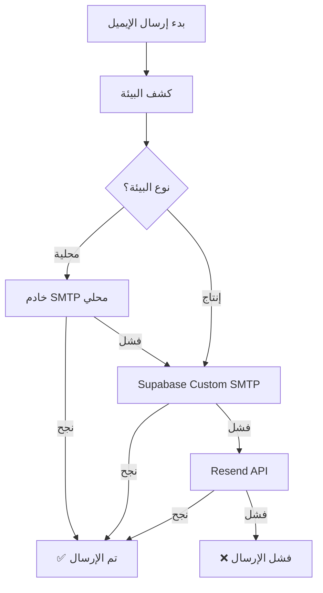

# 🌍 نظام الإيميل المرن - يعمل على أي دومين

## 📋 نظرة عامة

تم تطوير نظام إرسال الإيميلات ليكون **مرناً بالكامل** ويعمل على أي دومين أو بيئة بدون تخصيص مسبق. النظام يكتشف البيئة تلقائياً ويختار أفضل طريقة إرسال.

## 🎯 المبادئ الأساسية

### ✅ المرونة الكاملة
- **لا توجد قيود على الدومين** - يعمل على localhost, Vercel, دومين مستقل
- **كشف تلقائي للبيئة** - يحدد نوع البيئة ويتكيف معها
- **لا حاجة لتعديل الكود** عند تغيير الدومين

### 🧠 الذكاء التكيفي
- يختار أفضل طريقة إرسال حسب البيئة
- يتعامل مع الأخطاء بذكاء مع نظام احتياطي
- يسجل معلومات مفصلة للتشخيص

## 🔧 كيف يعمل النظام

### 1. الكشف التلقائي للبيئة
```typescript
// يحدد النظام البيئة تلقائياً
const env = detectEnvironment();
// النتيجة:
{
  isDevelopment: boolean,
  isProduction: boolean,
  isLocalhost: boolean,
  isVercel: boolean,
  currentDomain: string,
  currentUrl: string
}
```

### 2. اختيار طريقة الإرسال
```typescript
// في البيئة المحلية
if (env.isLocalhost) {
  // خادم SMTP محلي → Supabase → Resend
}

// في بيئة الإنتاج (أي دومين)
else {
  // Supabase Custom SMTP → Resend
}
```

## 📁 الملفات الجديدة

### `src/utils/environmentDetector.ts`
- **الغرض:** كشف البيئة تلقائياً
- **الوظائف:**
  - `detectEnvironment()` - تحديد نوع البيئة
  - `getSMTPConfig()` - اختيار إعدادات SMTP المناسبة
  - `logEnvironmentInfo()` - تسجيل معلومات التشخيص

### `src/lib/finalEmailService.ts` (محدث)
- **التحديثات:**
  - استخدام النظام المرن الجديد
  - إرسال ذكي حسب البيئة
  - تسجيل مفصل للعمليات

## 🌐 البيئات المدعومة

### 🏠 التطوير المحلي
- **الدومين:** `localhost:5173`
- **الطريقة الأولى:** خادم SMTP محلي (port 3001)
- **الاحتياطي:** Supabase Custom SMTP

### ☁️ Vercel
- **الدومين:** `*.vercel.app`
- **الطريقة الأولى:** Supabase Custom SMTP
- **الاحتياطي:** Resend API

### 🌍 دومين مستقل
- **الدومين:** أي دومين مخصص
- **الطريقة الأولى:** Supabase Custom SMTP
- **الاحتياطي:** Resend API

## 🔄 تدفق الإرسال



## 🛠️ الإعداد والاستخدام

### 1. متغيرات البيئة المرنة
```env
# إعدادات مرنة - تتكيف تلقائياً
VITE_APP_URL=auto
VITE_SITE_URL=auto
SMTP_SERVER_HOST=auto

# إعدادات Supabase (ثابتة)
VITE_SUPABASE_URL=https://sbtzngewizgeqzfbhfjy.supabase.co
VITE_SUPABASE_ANON_KEY=your_anon_key
VITE_SUPABASE_SERVICE_ROLE_KEY=your_service_role_key
```

### 2. الاستخدام في الكود
```typescript
import AdvancedEmailService from './lib/finalEmailService';

// الإرسال يتم تلقائياً حسب البيئة
const result = await AdvancedEmailService.sendVerificationEmail(
  'user@example.com',
  'verification_token'
);
```

## 📊 مراقبة النظام

### تسجيل العمليات
```javascript
// يسجل النظام معلومات مفصلة
console.log('🌍 معلومات البيئة الحالية:');
console.log('📍 النطاق: example.com');
console.log('🔗 URL الكامل: https://example.com');
console.log('🚀 الإنتاج: نعم');
console.log('📧 نوع SMTP: supabase');
```

### فحص التوافق
```typescript
import { checkEnvironmentCompatibility } from './utils/environmentDetector';

const compatibility = checkEnvironmentCompatibility();
if (!compatibility.isCompatible) {
  console.log('⚠️ مشاكل:', compatibility.issues);
  console.log('💡 توصيات:', compatibility.recommendations);
}
```

## 🎯 الفوائد

### ✅ للمطورين
- **لا حاجة لتعديل الكود** عند تغيير الدومين
- **تشخيص سهل** مع تسجيل مفصل
- **اختبار محلي سهل** مع خادم SMTP مدمج

### ✅ للنشر
- **يعمل فوراً** على أي دومين جديد
- **لا حاجة لإعدادات خاصة** لكل بيئة
- **موثوقية عالية** مع نظام احتياطي متعدد المستويات

## 🔮 المستقبل

النظام مصمم ليكون قابلاً للتوسع:
- إضافة بيئات جديدة بسهولة
- دعم خدمات SMTP إضافية
- تحسينات الأداء والموثوقية

---

**📝 ملاحظة:** هذا النظام يضمن عمل الإيميلات على أي دومين بدون تدخل يدوي، مما يجعل النشر والصيانة أسهل بكثير.
