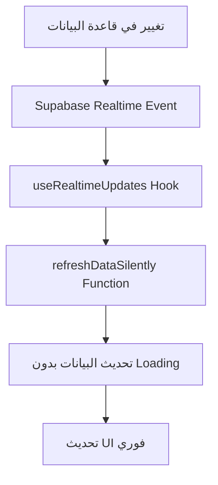
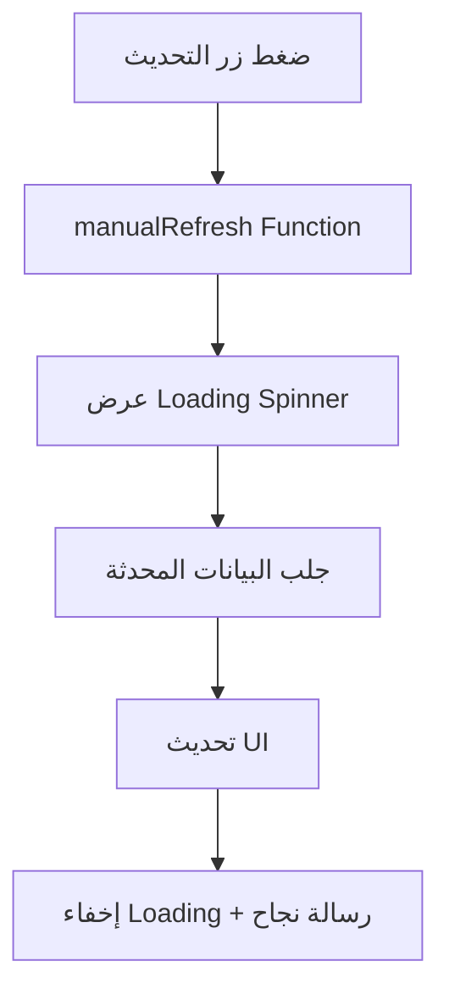

# 🚀 نظام التحديث التلقائي المتقدم - موقع رزقي

**تاريخ التطوير:** 18-08-2025  
**المطور:** Augment Agent  
**الحالة:** ✅ مكتمل ومختبر

---

## 🎯 نظرة عامة

تم تطوير نظام تحديث تلقائي متقدم لصفحة إدارة المستخدمين يوفر:

- **تحديث فوري وسلس** للبيانات بدون أيقونات loading
- **مراقبة Real-time** للتغييرات في قاعدة البيانات
- **تحديث تلقائي** لجميع الأقسام والإحصائيات
- **تجربة مستخدم محسنة** مع مؤشرات بصرية أنيقة

---

## 🔧 المكونات التقنية

### 1. useRealtimeUpdates Hook

**الملف:** `src/hooks/useRealtimeUpdates.ts`

```typescript
// مراقبة تغييرات جدول المستخدمين
useRealtimeUpdates({
  table: 'users',
  onInsert: handleUserChange,
  onUpdate: handleUserChange,
  onDelete: handleUserChange,
  enabled: true
});
```

**الميزات:**
- مراقبة أحداث INSERT, UPDATE, DELETE
- إدارة اشتراكات Supabase Realtime
- تنظيف الموارد تلقائياً
- دعم الفلاتر المخصصة

### 2. autoRefreshService

**الملف:** `src/services/autoRefreshService.ts`

```typescript
// تسجيل callback للتحديث
autoRefreshService.registerRefreshCallback('users-management', refreshFunction);

// جلب بيانات محدثة
const freshStats = await autoRefreshService.fetchFreshStats();
const freshUsers = await autoRefreshService.fetchFreshUsers(filters);
```

**الميزات:**
- إدارة مركزية للتحديث
- جلب البيانات المحدثة
- تسجيل callbacks متعددة
- تحديث دوري احتياطي

### 3. التطبيق في UnifiedUsersManagement

**الملف:** `src/components/admin/users/UnifiedUsersManagement.tsx`

```typescript
// إعداد التحديث التلقائي
const { register, unregister } = useAutoRefresh('users-management', refreshDataSilently);

// Real-time updates
useUsersRealtimeUpdates(refreshDataSilently, true);
useStatsRealtimeUpdates(fetchStats, true);
```

---

## 🎨 التحسينات البصرية

### 1. مؤشر التحديث التلقائي

```jsx
<div className="flex items-center gap-1 text-green-600">
  <div className="w-2 h-2 bg-green-500 rounded-full animate-pulse"></div>
  <span className="text-xs">تحديث تلقائي</span>
</div>
```

### 2. إحصائيات مباشرة في الهيدر

```jsx
<div className="flex items-center gap-4 mt-2 text-sm text-gray-500">
  <span>المجموع: {stats.totalUsers}</span>
  <span>النشطون: {stats.activeUsers}</span>
  <span>المحظورون: {stats.blockedUsers}</span>
  <span>المحققون: {stats.verifiedUsers}</span>
  <span>جدد اليوم: {stats.newUsersToday}</span>
</div>
```

### 3. زر التحديث اليدوي

```jsx
<button
  onClick={manualRefresh}
  disabled={loading}
  className="modern-btn modern-btn-secondary flex items-center gap-2"
>
  <RefreshCw className={`w-4 h-4 ${loading ? 'animate-spin' : ''}`} />
  تحديث
</button>
```

---

## ⚡ كيفية العمل

### 1. التحديث التلقائي



### 2. التحديث اليدوي



---

## 🔄 دورة حياة التحديث

### 1. التهيئة
- تسجيل callbacks للتحديث
- إعداد Real-time subscriptions
- جلب البيانات الأولية

### 2. المراقبة
- مراقبة تغييرات قاعدة البيانات
- استقبال أحداث Real-time
- تحديث البيانات تلقائياً

### 3. التنظيف
- إلغاء اشتراكات Real-time
- تنظيف callbacks المسجلة
- تحرير الموارد

---

## 📊 الجداول المراقبة

| الجدول | الأحداث المراقبة | التأثير |
|--------|-----------------|---------|
| `users` | INSERT, UPDATE, DELETE | تحديث قائمة المستخدمين والإحصائيات |
| `reports` | INSERT, UPDATE, DELETE | تحديث عدد البلاغات المعلقة |
| `admin_actions` | INSERT, UPDATE, DELETE | تحديث سجل الإجراءات الإدارية |

---

## 🎯 الفوائد المحققة

### ✅ تجربة المستخدم
- **تحديث فوري** بدون إعادة تحميل
- **مؤشرات بصرية** واضحة ومفيدة
- **استجابة سريعة** للتغييرات
- **واجهة سلسة** بدون انقطاع

### ✅ الأداء
- **تحديث خلف الكواليس** بدون تأثير على UI
- **استهلاك موارد محسن** مع Real-time subscriptions
- **تحديث انتقائي** للبيانات المطلوبة فقط
- **تنظيف تلقائي** للموارد غير المستخدمة

### ✅ الموثوقية
- **نظام احتياطي** للتحديث الدوري
- **معالجة الأخطاء** المتقدمة
- **إعادة الاتصال التلقائي** عند انقطاع الشبكة
- **تسجيل مفصل** للمراقبة والتشخيص

---

## 🚀 التطوير المستقبلي

### المرحلة التالية
- [ ] تطبيق النظام على صفحات إدارية أخرى
- [ ] إضافة إشعارات Real-time للأدمنز
- [ ] تحسين أداء التحديث للبيانات الكبيرة
- [ ] إضافة إعدادات تخصيص التحديث

### التحسينات المقترحة
- [ ] ضغط البيانات المنقولة
- [ ] تحديث جزئي للجداول الكبيرة
- [ ] إعدادات تحكم في تكرار التحديث
- [ ] مؤشرات أداء مفصلة

---

## 📝 ملاحظات التطوير

### الاعتبارات التقنية
- استخدام Supabase Realtime للمراقبة
- إدارة دورة حياة الاشتراكات بعناية
- تحسين استهلاك الذاكرة والشبكة
- معالجة حالات الخطأ والانقطاع

### أفضل الممارسات
- تنظيف الموارد عند إلغاء التحميل
- استخدام useCallback لتحسين الأداء
- تجنب التحديث المفرط للبيانات
- توفير خيارات تحكم للمستخدم

---

**🎯 النتيجة:** نظام تحديث تلقائي متقدم يوفر تجربة مستخدم استثنائية مع أداء محسن وموثوقية عالية.
