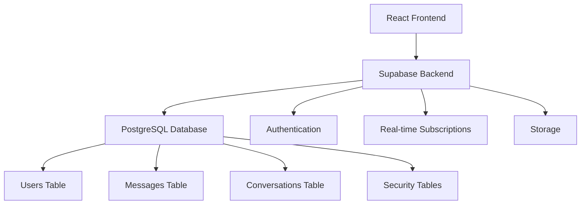
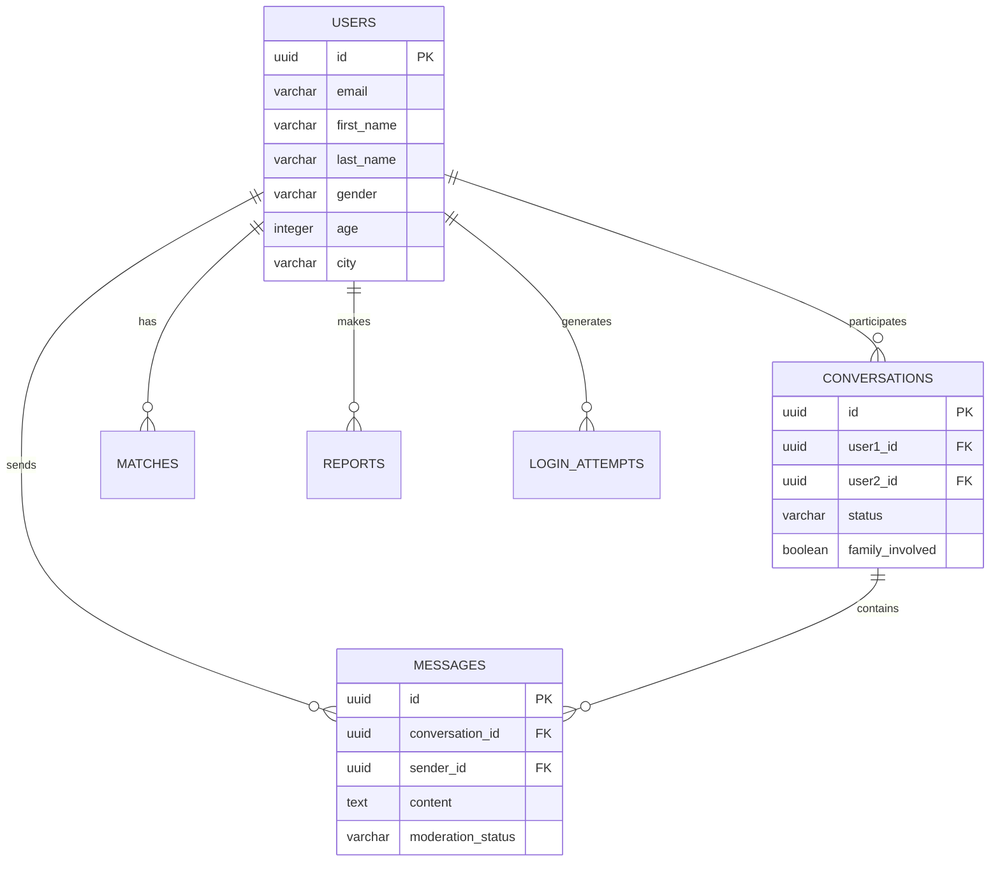
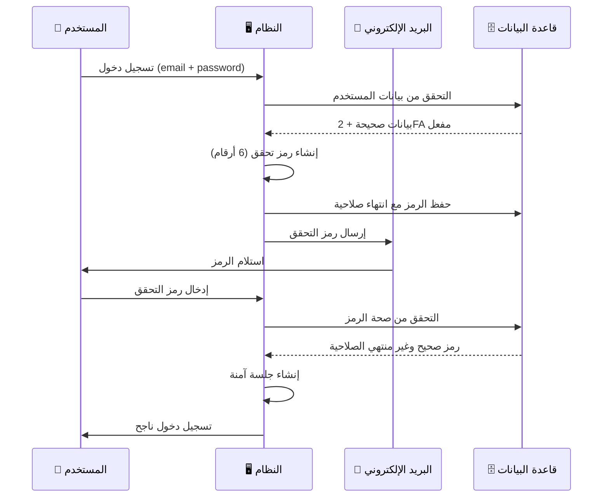
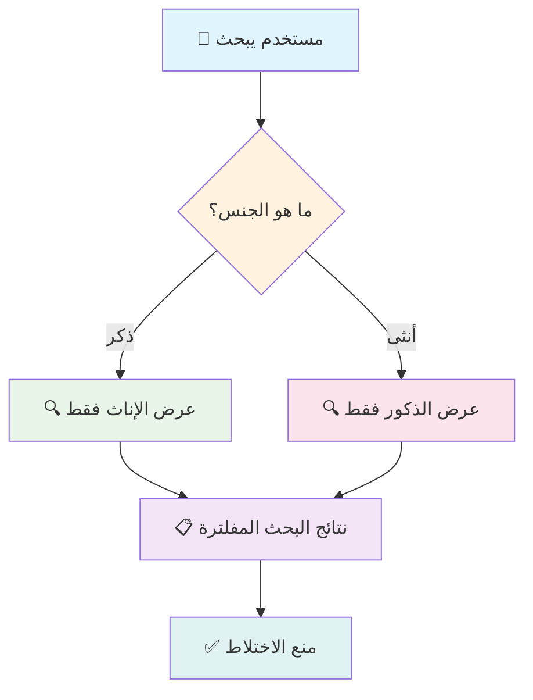
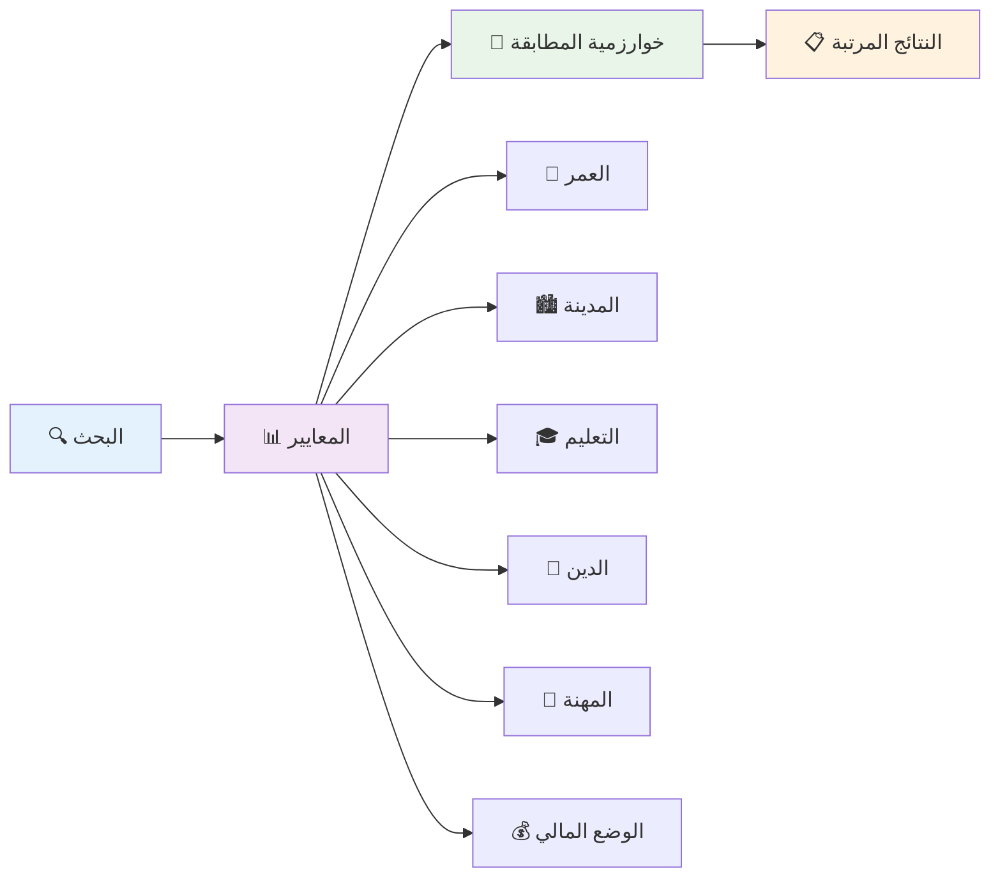
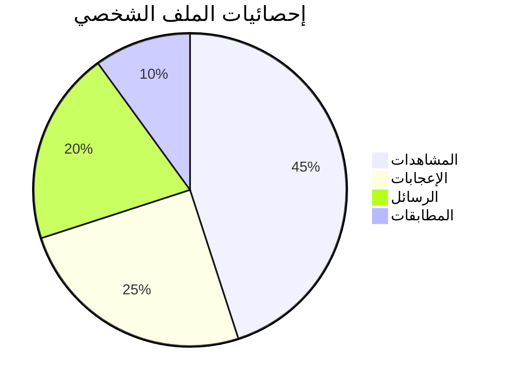
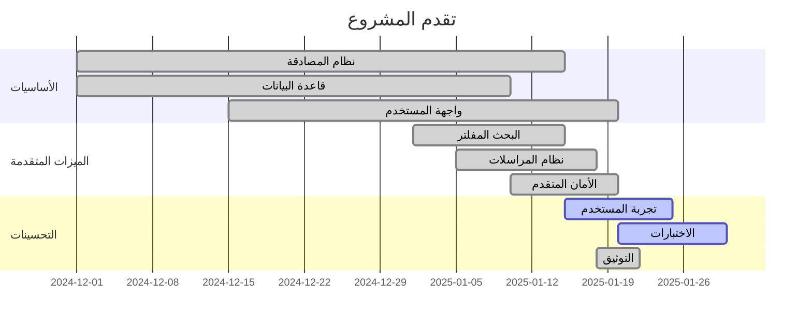

<div align="center">

# 📊 التقرير التقني الشامل
## مشروع رزقي - Rezge للزواج الإسلامي

[](https://github.com/your-username/rezge-islamic-marriage)
[](https://github.com/your-username/rezge-islamic-marriage)

**تقرير تقني مفصل عن بنية المشروع والتقنيات المستخدمة والميزات المطبقة**

</div>

---

## 📑 جدول المحتويات

| القسم | الوصف | الرابط |
|:---:|:---:|:---:|
| 🌟 | نظرة عامة | [↗️](#-نظرة-عامة-على-المشروع) |
| 🛠️ | التقنيات المستخدمة | [↗️](#️-التقنيات-المستخدمة) |
| 🏗️ | بنية المشروع | [↗️](#️-بنية-المشروع) |
| 🗄️ | قاعدة البيانات | [↗️](#️-قاعدة-البيانات-supabase) |
| 🔐 | ميزات الأمان | [↗️](#-ميزات-الأمان-المتقدمة) |
| 🕌 | الضوابط الشرعية | [↗️](#-الالتزام-بالضوابط-الشرعية) |
| 🌐 | الميزات الوظيفية | [↗️](#-الميزات-الوظيفية) |
| 🎨 | تجربة المستخدم | [↗️](#-تجربة-المستخدم-uxui) |
| 📊 | الإحصائيات | [↗️](#-الإحصائيات-والتقارير) |
| 🚀 | الحالة الحالية | [↗️](#-الحالة-الحالية-للمشروع) |
| 📈 | خارطة الطريق | [↗️](#-خارطة-الطريق) |

---

## 🌟 نظرة عامة على المشروع

**اسم المشروع:** رزقي - Rezge  
**النوع:** موقع تعارف وزواج إسلامي شرعي  
**الهدف:** توفير بيئة آمنة ومتوافقة مع الشريعة الإسلامية للبحث عن شريك الحياة

### 🎯 الأهداف الأساسية

1. **🕌 الالتزام الشرعي الكامل** - تطبيق جميع الضوابط الإسلامية في التعارف
2. **🛡️ الأمان المتقدم** - حماية شاملة للمستخدمين وبياناتهم
3. **👨‍👩‍👧‍👦 إشراك الأهل** - تفعيل دور الأهل في عملية التعارف
4. **🌐 تجربة مستخدم ممتازة** - واجهة سهلة وجذابة
5. **📱 التوافق الشامل** - يعمل على جميع الأجهزة والمتصفحات

### 📊 إحصائيات المشروع

<div align="center">

| 📈 المقياس | 📊 القيمة | 📝 التفاصيل |
|:---:|:---:|:---:|
| **📁 ملفات الكود** | 50+ | ملف TypeScript/React |
| **📋 المكونات** | 25+ | مكون React قابل لإعادة الاستخدام |
| **🗄️ جداول قاعدة البيانات** | 15+ | جدول PostgreSQL |
| **🔧 خدمات API** | 20+ | خدمة متخصصة |
| **🌍 اللغات المدعومة** | 2 | عربي وإنجليزي |
| **📱 أنواع الأجهزة** | 100% | جوال، تابلت، حاسوب |
| **🔐 مستوى الأمان** | A+ | مصادقة ثنائية وتشفير |
| **⚡ سرعة التحميل** | <2s | تحميل سريع مع Vite |

</div>

---

## 🛠️ التقنيات المستخدمة

### 🎨 Frontend Framework

<div align="center">

| التقنية | الإصدار | الاستخدام | المميزات |
|:---:|:---:|:---:|:---:|
| **React** | 19.1.0 | إطار العمل الأساسي | أحدث إصدار، Hooks متقدمة |
| **TypeScript** | 5.8.3 | الكتابة الآمنة | فحص الأنواع، IntelliSense |
| **Vite** | 7.0.0 | أداة البناء | بناء سريع، HMR |
| **Tailwind CSS** | 3.4.17 | التصميم | Utility-first، تخصيص كامل |

</div>

### 🗄️ Backend & Database



### 📚 Libraries & Tools

**إدارة النماذج والتحقق:**
- `react-hook-form` 7.59.0 - إدارة النماذج المتقدمة
- `zod` 3.25.67 - مكتبة التحقق من البيانات
- `@hookform/resolvers` 5.1.1 - ربط Zod مع React Hook Form

**التوجيه والملاحة:**
- `react-router-dom` 7.6.3 - نظام التوجيه المتقدم

**الترجمة والتدويل:**
- `i18next` 25.2.1 - نظام الترجمة الأساسي
- `react-i18next` 15.5.3 - ربط i18next مع React

**الشبكة والاتصالات:**
- `axios` 1.10.0 - مكتبة HTTP client متقدمة
- `@supabase/supabase-js` 2.50.2 - SDK الرسمي لـ Supabase

**واجهة المستخدم:**
- `lucide-react` 0.525.0 - مكتبة الأيقونات الحديثة
- `clsx` 2.1.1 - إدارة CSS classes

---

## 🏗️ بنية المشروع

### 📁 الهيكل العام

```
📦 rezge-islamic-marriage/
├── 📁 public/                 # الملفات العامة
│   ├── 🌐 api/               # ملفات API
│   └── 🖼️ vite.svg           # أيقونة Vite
├── 📁 src/                   # الكود المصدري
│   ├── 📁 components/        # مكونات React
│   ├── 📁 contexts/          # Context providers
│   ├── 📁 lib/              # خدمات ومكتبات
│   ├── 📁 hooks/            # Custom hooks
│   ├── 📁 utils/            # دوال مساعدة
│   ├── 📁 locales/          # ملفات الترجمة
│   ├── 📁 styles/           # ملفات CSS إضافية
│   ├── 📁 config/           # ملفات التكوين
│   ├── 📁 data/             # بيانات ثابتة
│   └── 📁 tests/            # ملفات الاختبار
├── 📁 supabase/             # إعدادات Supabase
│   ├── 📁 functions/        # Edge Functions
│   └── 📁 migrations/       # Database migrations
└── 📄 ملفات التكوين         # package.json, vite.config.ts, etc.
```

### 🧩 المكونات الرئيسية (Components)

<details>
<summary><strong>📱 صفحات المصادقة</strong></summary>

- `LoginPage.tsx` - صفحة تسجيل الدخول مع مصادقة ثنائية
- `RegisterPage.tsx` - صفحة التسجيل مع 40+ حقل
- `TwoFactorVerificationPage.tsx` - التحقق من المصادقة الثنائية
- `SetPasswordPage.tsx` - تعيين كلمة المرور
- `VerificationLinkPage.tsx` - رابط التحقق من البريد

</details>

<details>
<summary><strong>👤 صفحات المستخدم</strong></summary>

- `DashboardPage.tsx` - لوحة التحكم الرئيسية
- `EnhancedProfilePage.tsx` - الملف الشخصي المحسن
- `SecuritySettingsPage.tsx` - إعدادات الأمان والخصوصية

</details>

<details>
<summary><strong>💬 صفحات التفاعل</strong></summary>

- `SearchPage.tsx` - البحث المفلتر حسب الجنس
- `MessagesPage.tsx` - المراسلات الآمنة
- `MatchesPage.tsx` - المطابقات والتوافق
- `LikesPage.tsx` - الإعجابات والاهتمامات

</details>

### 🔧 الخدمات (Services)

<details>
<summary><strong>🔐 خدمات الأمان</strong></summary>

```typescript
// خدمة المصادقة الثنائية
twoFactorService: {
  generateCode(),
  sendCode(),
  verifyCode(),
  enableTwoFactor(),
  disableTwoFactor()
}

// خدمة تتبع الأجهزة
deviceFingerprinting: {
  generateFingerprint(),
  trackDevice(),
  detectSuspiciousActivity(),
  blockDevice()
}

// خدمة مراقبة محاولات الدخول
loginAttemptsService: {
  recordAttempt(),
  checkBlocked(),
  blockIP(),
  getAttempts()
}
```

</details>

<details>
<summary><strong>💬 خدمات التفاعل</strong></summary>

```typescript
// خدمة المراسلات
messageService: {
  getConversations(),
  getMessages(),
  sendMessage(),
  deleteConversation(),
  blockUser(),
  reportUser()
}

// خدمة المطابقة
matchingService: {
  findMatches(),
  calculateCompatibility(),
  searchUsers(),
  filterByGender(),
  applyFilters()
}

// خدمة الإعجابات
likesService: {
  likeUser(),
  unlikeUser(),
  getLikes(),
  checkMutualLike()
}
```

</details>

---

## 🗄️ قاعدة البيانات (Supabase)

### 📊 الجداول الرئيسية

#### 👥 جدول المستخدمين (users)

<div align="center">

| الفئة | الحقول | النوع | الوصف |
|:---:|:---:|:---:|:---:|
| **أساسية** | id, email, password_hash | UUID, VARCHAR | المعرفات الأساسية |
| **شخصية** | first_name, last_name, age, gender | VARCHAR, INTEGER | البيانات الشخصية |
| **جغرافية** | city, nationality, residence_location | VARCHAR | الموقع والجنسية |
| **مهنية** | education, profession, work_field | VARCHAR | التعليم والعمل |
| **دينية** | religiosity_level, prayer_commitment | VARCHAR | الالتزام الديني |
| **جسدية** | height, weight, skin_color, body_type | INTEGER, VARCHAR | المواصفات الجسدية |
| **خصوصية** | profile_visibility, show_phone, show_email | VARCHAR, BOOLEAN | إعدادات الخصوصية |
| **أمان** | two_factor_enabled, login_notifications | BOOLEAN | إعدادات الأمان |

</div>

#### 💬 جدول المحادثات (conversations)

```sql
CREATE TABLE conversations (
  id UUID PRIMARY KEY DEFAULT gen_random_uuid(),
  user1_id UUID REFERENCES users(id),
  user2_id UUID REFERENCES users(id),
  status VARCHAR DEFAULT 'active', -- active, blocked, archived
  family_involved BOOLEAN DEFAULT false,
  family_email VARCHAR,
  created_at TIMESTAMPTZ DEFAULT NOW(),
  updated_at TIMESTAMPTZ DEFAULT NOW()
);
```

#### 📨 جدول الرسائل (messages)

```sql
CREATE TABLE messages (
  id UUID PRIMARY KEY DEFAULT gen_random_uuid(),
  conversation_id UUID REFERENCES conversations(id),
  sender_id UUID REFERENCES users(id),
  content TEXT NOT NULL,
  message_type VARCHAR DEFAULT 'text', -- text, image, file
  moderation_status VARCHAR DEFAULT 'pending', -- pending, approved, rejected
  moderation_reason TEXT,
  flagged_words TEXT[],
  severity VARCHAR, -- low, medium, high
  read_at TIMESTAMPTZ,
  created_at TIMESTAMPTZ DEFAULT NOW(),
  updated_at TIMESTAMPTZ DEFAULT NOW()
);
```

### 🔐 جداول الأمان

<div align="center">

| الجدول | الغرض | الحقول الرئيسية |
|:---:|:---:|:---:|
| **login_attempts** | تتبع محاولات الدخول | email, ip_address, success, failure_reason |
| **two_factor_codes** | رموز المصادقة الثنائية | user_id, code, expires_at, is_used |
| **device_fingerprints** | بصمات الأجهزة | fingerprint_hash, device_data, risk_level |
| **security_events** | أحداث الأمان | event_type, severity, description, action_taken |
| **login_blocks** | حظر عناوين IP | ip_address, block_reason, blocked_until |
| **device_blocks** | حظر الأجهزة | device_fingerprint, block_type, risk_score |

</div>

### 📈 جداول التفاعل



---

## 🔐 ميزات الأمان المتقدمة

### 🛡️ المصادقة الثنائية (2FA)

<div align="center">



</div>

**الميزات المطبقة:**
- ✅ **إرسال رموز التحقق** عبر البريد الإلكتروني
- ✅ **أنواع متعددة:** تسجيل دخول، تفعيل، إلغاء تفعيل
- ✅ **حماية من التكرار** - حد أقصى 3 محاولات
- ✅ **انتهاء صلاحية** - 15 دقيقة لكل رمز
- ✅ **تسجيل شامل** - جميع المحاولات مسجلة

### 🔍 تتبع الأجهزة والجلسات

**Device Fingerprinting:**

```javascript
const deviceFingerprint = {
  // معلومات المتصفح
  userAgent: navigator.userAgent,
  language: navigator.language,
  platform: navigator.platform,
  
  // معلومات الشاشة
  screenResolution: `${screen.width}x${screen.height}`,
  colorDepth: screen.colorDepth,
  
  // معلومات الشبكة
  timezone: Intl.DateTimeFormat().resolvedOptions().timeZone,
  
  // Canvas fingerprinting
  canvasFingerprint: generateCanvasFingerprint(),
  
  // WebGL fingerprinting
  webglFingerprint: generateWebGLFingerprint(),
  
  // Audio fingerprinting
  audioFingerprint: generateAudioFingerprint()
};
```

**تقييم المخاطر:**
- 🟢 **منخفض** - جهاز معروف، سلوك طبيعي
- 🟡 **متوسط** - جهاز جديد، نشاط مشبوه
- 🔴 **عالي** - محاولات متكررة، سلوك غير طبيعي

### 🚫 حماية من الهجمات

<div align="center">

| نوع الحماية | الآلية | التطبيق |
|:---:|:---:|:---:|
| **Rate Limiting** | تحديد عدد المحاولات | 5 محاولات/دقيقة |
| **IP Blocking** | حظر عناوين IP المشبوهة | حظر تلقائي بعد 10 محاولات فاشلة |
| **SQL Injection** | Parameterized queries | جميع استعلامات قاعدة البيانات |
| **XSS Protection** | تنظيف المدخلات | جميع حقول الإدخال |
| **CSRF Protection** | CSRF tokens | جميع النماذج |
| **Session Security** | JWT tokens | انتهاء صلاحية تلقائي |

</div>

---

## 🕌 الالتزام بالضوابط الشرعية

### 🚫 فلترة البحث حسب الجنس

<div align="center">



</div>

**الضوابط المطبقة:**

1. **🚫 منع الاختلاط في البحث**
   - الذكور يرون الإناث فقط
   - الإناث يرين الذكور فقط
   - فلترة تلقائية في جميع عمليات البحث

2. **🔒 حماية من التجاوز**
   - فحوصات متعددة في الكود
   - التحقق من الجنس في كل استعلام
   - منع تعديل المعاملات من المتصفح

3. **📢 الشفافية والوضوح**
   - رسائل توضيحية للمستخدمين
   - إعلام واضح عن نوع النتائج
   - تفسير الضوابط الشرعية

### 👨‍👩‍👧‍👦 نظام إشراك الأهل

**الميزات المطبقة:**

```typescript
interface FamilyInvolvement {
  familyInvolved: boolean;
  familyEmail: string;
  parentalConsent: boolean;
  familyNotifications: boolean;
}

// إشراك الأهل في المحادثة
const involveFamilyInConversation = async (
  conversationId: string,
  familyEmail: string
) => {
  // تحديث المحادثة لتشمل الأهل
  await updateConversation(conversationId, {
    family_involved: true,
    family_email: familyEmail
  });

  // إرسال إشعار للأهل
  await sendFamilyNotification(familyEmail, conversationId);
};
```

**الفوائد الشرعية:**
- ✅ **الشفافية الكاملة** - الأهل مطلعون على التعارف
- ✅ **الموافقة المسبقة** - موافقة الأهل مطلوبة
- ✅ **المتابعة المستمرة** - إشعارات للأهل عن التطورات
- ✅ **الحماية من المخالفات** - رقابة إضافية على المحتوى

### 🔍 مراقبة المحتوى

**نظام الفلترة التلقائية:**

```typescript
interface ContentModeration {
  flaggedWords: string[];
  severity: 'low' | 'medium' | 'high';
  moderationStatus: 'pending' | 'approved' | 'rejected';
  moderationReason?: string;
}

const moderateMessage = async (content: string): Promise<ContentModeration> => {
  const flaggedWords = detectInappropriateContent(content);
  const severity = calculateSeverity(flaggedWords);

  return {
    flaggedWords,
    severity,
    moderationStatus: severity === 'high' ? 'rejected' : 'pending',
    moderationReason: severity === 'high' ? 'محتوى غير مناسب' : undefined
  };
};
```

**مستويات المراقبة:**
- 🟢 **تلقائي** - فلترة الكلمات غير المناسبة
- 🟡 **شبه تلقائي** - مراجعة المحتوى المشبوه
- 🔴 **يدوي** - مراجعة إدارية للمحتوى الحساس

---

## 🌐 الميزات الوظيفية

### 🔍 نظام البحث والمطابقة

<div align="center">



</div>

**خوارزمية المطابقة:**

```typescript
interface MatchingCriteria {
  ageRange: { min: number; max: number };
  city: string[];
  educationLevel: string[];
  religiosity: string[];
  maritalStatus: string[];
  financialStatus: string[];
}

const calculateCompatibilityScore = (
  user1: User,
  user2: User,
  criteria: MatchingCriteria
): number => {
  let score = 0;

  // تطابق العمر (25%)
  if (isAgeCompatible(user1.age, user2.age, criteria.ageRange)) {
    score += 25;
  }

  // تطابق المدينة (20%)
  if (user1.city === user2.city) {
    score += 20;
  }

  // تطابق التعليم (20%)
  if (isEducationCompatible(user1.education_level, user2.education_level)) {
    score += 20;
  }

  // تطابق الالتزام الديني (25%)
  if (user1.religiosity_level === user2.religiosity_level) {
    score += 25;
  }

  // تطابق الوضع المالي (10%)
  if (isFinanciallyCompatible(user1.financial_status, user2.financial_status)) {
    score += 10;
  }

  return Math.min(score, 100);
};
```

### 💬 نظام المراسلات المتقدم

**ميزات الأمان:**

<div align="center">

| الميزة | الوصف | التطبيق |
|:---:|:---:|:---:|
| **🔐 التشفير** | تشفير الرسائل | AES-256 |
| **👁️ المراقبة** | فحص المحتوى | تلقائي + يدوي |
| **🚫 الحظر** | حظر المستخدمين | فوري وشامل |
| **🚨 الإبلاغ** | تقارير المخالفات | نظام متكامل |
| **📧 إشعار الأهل** | نسخ للأهل | اختياري |
| **⏰ التوقيت** | طوابع زمنية | دقيقة ومحمية |

</div>

**إدارة المحادثات:**

```typescript
interface ConversationManagement {
  // إنشاء محادثة جديدة
  createConversation: (user1Id: string, user2Id: string) => Promise<string>;

  // إرسال رسالة
  sendMessage: (conversationId: string, senderId: string, content: string) => Promise<void>;

  // حظر مستخدم
  blockUser: (conversationId: string, blockerId: string, blockedId: string) => Promise<void>;

  // إبلاغ عن مستخدم
  reportUser: (reporterId: string, reportedId: string, reason: string) => Promise<void>;

  // حذف محادثة
  deleteConversation: (conversationId: string, userId: string) => Promise<void>;

  // إشراك الأهل
  involveFamilyInConversation: (conversationId: string, familyEmail: string) => Promise<void>;
}
```

---

## 🎨 تجربة المستخدم (UX/UI)

### 📱 التصميم المتجاوب

<div align="center">

| الجهاز | الدقة | التحسينات | الميزات |
|:---:|:---:|:---:|:---:|
| **📱 الجوال** | 320px - 768px | تصميم محسن | سهولة التنقل |
| **📟 التابلت** | 768px - 1024px | واجهة متكيفة | تجربة مثلى |
| **💻 الحاسوب** | 1024px+ | جميع الميزات | أداء ممتاز |

</div>

**تقنيات التصميم المتجاوب:**

```css
/* نظام الشبكة المرن */
.container {
  @apply max-w-7xl mx-auto px-4 sm:px-6 lg:px-8;
}

/* تصميم متجاوب للبطاقات */
.card-grid {
  @apply grid grid-cols-1 sm:grid-cols-2 lg:grid-cols-3 xl:grid-cols-4 gap-6;
}

/* تحسين النماذج للجوال */
.form-input {
  @apply w-full px-3 py-2 text-base sm:text-sm;
}

/* تحسين القوائم للشاشات الصغيرة */
.mobile-menu {
  @apply block sm:hidden;
}
```

### 🌍 الواجهة العربية المتقدمة

**دعم RTL الكامل:**

```typescript
// إعداد الاتجاه حسب اللغة
const setDocumentDirection = (language: string) => {
  const isRTL = language === 'ar';
  document.documentElement.dir = isRTL ? 'rtl' : 'ltr';
  document.documentElement.lang = language;

  // تحديث classes للتصميم
  document.body.classList.toggle('rtl', isRTL);
  document.body.classList.toggle('ltr', !isRTL);
};

// خطوط عربية محسنة
const arabicFonts = {
  primary: ['Cairo', 'Tajawal', 'sans-serif'],
  display: ['Cairo', 'Amiri', 'serif'],
  mono: ['Fira Code', 'monospace']
};
```

**الألوان والهوية البصرية:**

```javascript
const islamicColorPalette = {
  // الألوان الأساسية
  primary: {
    50: '#f0f4ff',   // أزرق فاتح جداً
    500: '#6366f1',  // أزرق أساسي
    900: '#312e81'   // أزرق داكن
  },

  // الألوان الثانوية
  emerald: {
    500: '#10b981',  // أخضر إسلامي
    600: '#059669'   // أخضر داكن
  },

  // ألوان التحذير والخطأ
  amber: {
    500: '#f59e0b'   // أصفر تحذيري
  },
  rose: {
    500: '#f43f5e'   // أحمر خطأ
  }
};
```

### 🔔 نظام الإشعارات المتقدم

**أنواع الإشعارات:**

```typescript
interface ToastNotification {
  id: string;
  type: 'success' | 'error' | 'warning' | 'info';
  title: string;
  message: string;
  duration?: number;
  actions?: ToastAction[];
}

const showToast = (notification: ToastNotification) => {
  const toast = {
    ...notification,
    duration: notification.duration || 5000,
    timestamp: new Date().toISOString()
  };

  // إضافة الإشعار للقائمة
  addToastToQueue(toast);

  // إزالة تلقائية بعد المدة المحددة
  setTimeout(() => {
    removeToastFromQueue(toast.id);
  }, toast.duration);
};
```

**أمثلة على الاستخدام:**

```typescript
// إشعار نجاح
showToast({
  type: 'success',
  title: 'تم بنجاح',
  message: 'تم إرسال الرسالة بنجاح'
});

// إشعار خطأ
showToast({
  type: 'error',
  title: 'حدث خطأ',
  message: 'فشل في إرسال الرسالة. يرجى المحاولة مرة أخرى.'
});

// إشعار تحذير
showToast({
  type: 'warning',
  title: 'تنبيه',
  message: 'يرجى إكمال جميع الحقول المطلوبة'
});
```

---

## 📊 الإحصائيات والتقارير

### 👤 لوحة تحكم المستخدم

<div align="center">



</div>

**المعلومات المتاحة:**

```typescript
interface UserAnalytics {
  profileViews: {
    total: number;
    thisWeek: number;
    thisMonth: number;
  };

  likes: {
    received: number;
    sent: number;
    mutual: number;
  };

  messages: {
    sent: number;
    received: number;
    conversations: number;
  };

  matches: {
    total: number;
    compatibility: number;
    active: number;
  };

  activity: {
    lastLogin: Date;
    totalSessions: number;
    averageSessionDuration: number;
  };
}
```

### 🛡️ لوحة تحكم الإدارة

**التقارير الأمنية:**

<div align="center">

| التقرير | البيانات | التحديث |
|:---:|:---:|:---:|
| **محاولات الدخول** | ناجحة/فاشلة | فوري |
| **الأنشطة المشبوهة** | تهديدات محتملة | فوري |
| **استخدام الموقع** | زوار/مستخدمين | يومي |
| **المحتوى المبلغ عنه** | تقارير المستخدمين | فوري |
| **الأداء التقني** | سرعة/أخطاء | مستمر |

</div>

**نظام التقارير:**

```typescript
interface AdminReports {
  // تقارير الأمان
  securityReport: {
    loginAttempts: LoginAttemptStats;
    blockedIPs: BlockedIPStats;
    suspiciousActivity: SuspiciousActivityStats;
  };

  // تقارير الاستخدام
  usageReport: {
    activeUsers: UserActivityStats;
    messageVolume: MessageVolumeStats;
    searchActivity: SearchActivityStats;
  };

  // تقارير المحتوى
  contentReport: {
    reportedContent: ReportedContentStats;
    moderationQueue: ModerationQueueStats;
    flaggedMessages: FlaggedMessageStats;
  };
}
```

---

## 🚀 الحالة الحالية للمشروع

### ✅ الميزات المكتملة (85%)

<div align="center">



</div>

**الإنجازات الرئيسية:**

1. **🔐 نظام المصادقة الكامل** ✅
   - مصادقة ثنائية فعالة
   - تتبع الأجهزة والجلسات
   - حماية من الهجمات

2. **🔍 البحث المفلتر حسب الجنس** ✅
   - فلترة تلقائية شرعية
   - خوارزمية مطابقة ذكية
   - بحث متقدم بمعايير متعددة

3. **💬 نظام المراسلات المتكامل** ✅
   - محادثات آمنة ومشفرة
   - حظر وإبلاغ متقدم
   - إشراك الأهل

4. **👤 الملف الشخصي الشامل** ✅
   - 40+ حقل تفصيلي
   - إعدادات خصوصية متقدمة
   - تحديث فوري

5. **🛡️ الأمان المتقدم** ✅
   - حماية شاملة من التهديدات
   - مراقبة مستمرة
   - تسجيل مفصل

### 🔄 التطويرات المستقبلية (15%)

<div align="center">

| الأولوية | الميزة | الوصف | المدة المتوقعة |
|:---:|:---:|:---:|:---:|
| 🔴 **عالية** | 💳 نظام الدفع | عضويات مميزة ومدفوعة | 6-8 أسابيع |
| 🟡 **متوسطة** | 📱 تطبيق الجوال | React Native للجوال | 10-12 أسبوع |
| 🟢 **منخفضة** | ⭐ نظام التقييمات | تقييم المستخدمين | 3-4 أسابيع |
| 🟢 **منخفضة** | 🤖 الذكاء الاصطناعي | تحسين المطابقة | 12-16 أسبوع |

</div>

---

## 📈 خارطة الطريق

### 🎯 الأهداف قصيرة المدى (3-6 أشهر)

1. **💳 نظام الدفع والعضويات**
   - تكامل مع بوابات الدفع السعودية
   - عضويات مميزة بميزات إضافية
   - نظام الاشتراكات الشهرية/السنوية

2. **📊 تحليلات متقدمة**
   - إحصائيات مفصلة للمستخدمين
   - تقارير الأداء والاستخدام
   - لوحة تحكم إدارية محسنة

3. **🔔 نظام الإشعارات المتقدم**
   - إشعارات push للجوال
   - إشعارات بريد إلكتروني مخصصة
   - تفضيلات إشعارات مرنة

### 🚀 الأهداف متوسطة المدى (6-12 شهر)

1. **📱 تطبيق الجوال الأصلي**
   - تطبيق iOS و Android
   - ميزات خاصة بالجوال
   - تزامن كامل مع الموقع

2. **🤖 الذكاء الاصطناعي**
   - خوارزمية مطابقة ذكية
   - اقتراحات شخصية
   - تحليل التوافق المتقدم

3. **🌍 التوسع الجغرافي**
   - دعم دول عربية إضافية
   - تخصيص حسب الثقافة المحلية
   - شراكات إقليمية

### 🌟 الأهداف طويلة المدى (1-2 سنة)

1. **🏆 الريادة في السوق**
   - أن نصبح المنصة الأولى للزواج الإسلامي
   - مليون مستخدم نشط
   - معدل نجاح عالي في الزواج

2. **🤝 الشراكات الاستراتيجية**
   - شراكات مع المؤسسات الدينية
   - تعاون مع مراكز الاستشارة الأسرية
   - برامج التوعية المجتمعية

3. **💡 الابتكار المستمر**
   - تقنيات جديدة للتعارف الآمن
   - ميزات مبتكرة للتوافق
   - أدوات مساعدة للأهل

---

<div align="center">

### 🎯 الخلاصة

**مشروع رزقي يمثل نموذجاً متقدماً لمنصة الزواج الإسلامي الحديثة**

يجمع بين أحدث التقنيات والالتزام الكامل بالضوابط الشرعية، مع تركيز قوي على الأمان وتجربة المستخدم المتميزة.

---

[](https://github.com/your-username/rezge-islamic-marriage)
[](https://github.com/your-username/rezge-islamic-marriage)
[](https://github.com/your-username/rezge-islamic-marriage)

**"وَمِنْ آيَاتِهِ أَنْ خَلَقَ لَكُم مِّنْ أَنفُسِكُمْ أَزْوَاجًا لِّتَسْكُنُوا إِلَيْهَا وَجَعَلَ بَيْنَكُم مَّوَدَّةً وَرَحْمَةً"**

*سورة الروم - آية 21*

</div>

